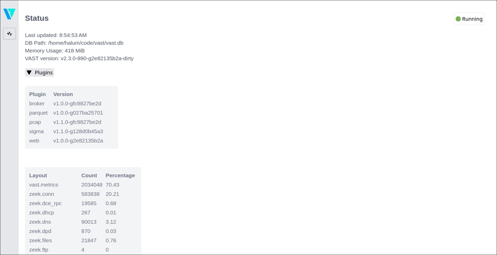

[VAST v2.4][github-vast-release] completes the switch to open storage formats,
and includes an early peek at three upcoming features for VAST: A web plugin
with a REST API and an integrated frontend user interface, Docker Compose
configuration files for getting started with VAST faster and showing how to
integrate VAST into your SOC, and new Python bindings that will make writing
integrations easier and allow for using VAST with your data science libraries,
like Pandas.

[github-vast-release]: https://github.com/tenzir/vast/releases/tag/v2.4.0

<!--truncate-->

## Preventing Vendor Lock-in with Open Storage

VAST's Apache Feather (V2) and Apache Parquet storage backends are now
considered stable, and the default storage format is now Feather. This marks the
beginning of a new era for VAST for all users: There is no more vendor lock-in
of your data!

Both as engineers and users of software we disdain vendor lock-in. Your data is
yours and no tool should hold it hostage. We want you to choose VAST because
it's the best engine when building a sustainable security data architecture. In
other words, *VAST decouples data acquisition from downstream security
analytics*. To this end, we are not only committed to open source, but also to
open standards—for storage and processing.

As of this release, VAST no longer supports *writing* to its old proprietary
storage format, but will still support *reading* from it until the next major
release. In the background, VAST transparently rebuilds old partitions to take
advantage of the new format without any downtime. This may cause some additional
load when starting VAST first up after the update, but ensures that queries run
as fast as possible once all old partitions have been converted.

If you want to know more about Feather and Parquet, check out our in-depth blog
post series on them:

1. [Enabling Open Investigations][parquet-and-feather-1]
2. [Writing Security Telemetry][parquet-and-feather-2]
3. [Data Engineering Woes][parquet-and-feather-3]

[parquet-and-feather-1]: /blog/parquet-and-feather-enabling-open-investigations/
[parquet-and-feather-2]: /blog/parquet-and-feather-writing-security-telemetry/
[parquet-and-feather-3]: /blog/parquet-and-feather-data-engineering-woes/

## What's Next?

VAST v2.4 contains a few new and experimental toys to play with. Here's an
overview of what they are, and how they all make it easier to integrate VAST
with other security tools.

### Docker Compose

A new set of [Docker Compose files][docker-compose] makes it easier than ever to
get started with VAST. This is not designed for high-performance deployments of
VAST, but rather to make it easier to try VAST out—all-batteries included,
because we want to use this to showcase and test the myriad of integrations
in a modern SOC.

Our vision for this is to show how VAST as a modular platform can power modern
and sustainable approaches to composable security.

[docker-compose]: /docs/setup/deploy/docker-compose

### REST API and Frontend User Interface

The experimental `web` plugin adds a [REST API][rest-api] to VAST, and also a
frontend user interface we [built in Svelte][frontend-code].

Both the API and the frontend are still considered unstable and subject to
change without notice. We plan to stabilize and version the API in the future.
Fundamentally, the API serves two purposes:

1. Make it easier to write integrations with VAST
2. Serve as a backend for VAST's bundled frontend

The frontend UI currently displays a status page for the installed VAST node.

<!--- this weird markup is to render a border around the image --->

We have some exciting features planned for both of these. Stay tuned!

[rest-api]: /docs/use/integrate/rest-api
[frontend-code]: https://github.com/tenzir/vast/tree/v2.4.0/plugins/web/ui

### Python Bindings

We want to make it as easy as possible to integrate VAST with other tools, so
we're working on making that as easy as possible using VAST's Python bindings.
The new bindings support analyzing data from VAST using industry-standard Python
libraries, like Pandas.

This is all enabled by our commitment to open standards: VAST leverages Apache
Arrow as its in-memory data representation. The Python bindings make it easy to
use VAST's security-specific data types. For example, when running a query, IP
addresses, subnets, and patterns automatically convert to the Python-native
types, as opposed to remaining binary blobs or sheer strings.

:::note Not yet on PyPI
VAST's new Python bindings are not yet on PyPI, as they are still heavily under
development. If you're too eager and cannot wait, go [check out the source
code][python-code].
:::

[python-code]: https://github.com/tenzir/vast/tree/v2.4.0/python

## Other Noteworthy Changes

A full list of changes to VAST since the last release is available in the
[changelog][changelog-2.4]. Here's a selection of changes that are particularly
noteworthy:

- VAST now loads all plugins by default. When asking new users for pitfalls they
  encountered, this ranked pretty high on the list of things we needed to
  change. To revert to the old behavior, set `vast.plugins: []` in your
  configuration file, or set `VAST_PLUGINS=` in your environment.
- The default endpoint changed from `localhost` to `127.0.0.1` to ensure a
  deterministic listening address.
- Exporting VAST's performance metrics via UDS no longer deadlocks VAST's
  metrics exporter when a listener is suspended.
- VAST's build process now natively supports building Debian packages. This
  makes upgrades for bare-metal deployments a breeze. As of this release, our
  CI/CD pipeline automatically attaches a Debian package in addition to the
  build archive to our releases.

[changelog-2.4]: /changelog#v240
